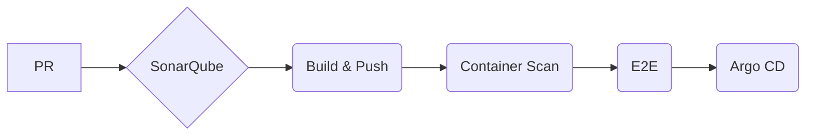

# 개발 베스트 프랙티스

## 코드베이스 조직

- **서비스 당 Git 저장소** 또는 **Mono-repo + Gradle 멀티 모듈**
- 공통 유틸리티는 `common` / `infra` 모듈로 분리

## 테스트 피라미드

1. **Unit**
2. **Contract (Consumer-Driven)**
3. **Integration** – TestContainers·Embedded Kafka
4. **E2E** – Cypress / Playwright

## CI/CD 파이프라인 예시

