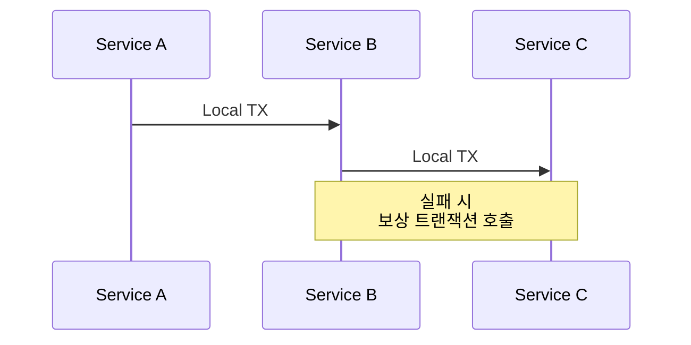

# 데이터 및 분산 트랜잭션

## DB-per-Service

- 스키마 충돌·락 경합 제거
- 서비스 경계와 데이터 경계 일치

## Outbox 패턴

1. 로컬 DB에 이벤트 레코드 삽입
2. CDC(예: Debezium) → Kafka Publish
3. “로깅 실패 = 트랜잭션 실패” 문제 해소

## Saga 패턴

- **행위 기준 보상**(Compensating Action)
- 상태 전환: `PENDING → COMPLETED / COMPENSATED`

