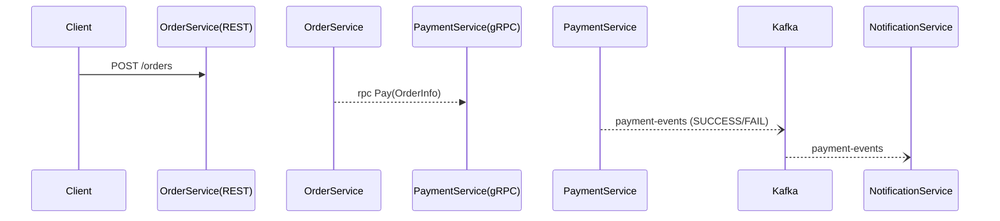

> Spring Boot & Armeria 실무 기준으로 **동기 vs 비동기** 통신을 비교합니다.

| 분류                                   | 특징                                           | Spring Boot 예시                                           | Armeria 예시                                 |
| -------------------------------------- | ---------------------------------------------- | ---------------------------------------------------------- | -------------------------------------------- |
| **REST (HTTP/JSON)**                   | 인간 친화적, 브라우저 호출 용이                | `@RestController` + WebMVC/WebFlux                         | Armeria `AnnotatedService` (HTTP/1.1)        |
| **gRPC (HTTP/2 Protobuf)**             | 바이너리, 스키마 기반, 양방향 스트림           | `spring-boot-starter-grpc` 또는 `grpc-spring-boot-starter` | `armeria-grpc` 한 포트로 REST+gRPC 동시 처리 |
| **메시지 브로커** (Kafka·RabbitMQ) | 완전 비동기, 이벤트 기반, 재시도·백프레셔 용이 | `spring-kafka`, `spring-amqp`                              | Armeria → Kafka Producer/Consumer 별도 모듈  |

### 5.1 패턴 선택 가이드

1. **사용자 즉시 응답 필요** → REST / gRPC **동기** 호출
2. **대량 이벤트·결제 트랜잭션 분리** → Kafka **비동기** Publish/Subscribe
3. **Stream 데이터** (주식 호가 등) → Armeria `ServerSentEvents` 또는 gRPC Stream

### 5.2 실습 예: 주문 → 결제

> **주요 포인트**
>
> - Armeria 서버 한 포트(8443)에서 `/api/**` REST와 `grpc.reflection.v1alpha.ServerReflection` gRPC 모두 수용
> - Spring Boot WebFlux + `Resilience4j`로 타임아웃·재시도 설정
