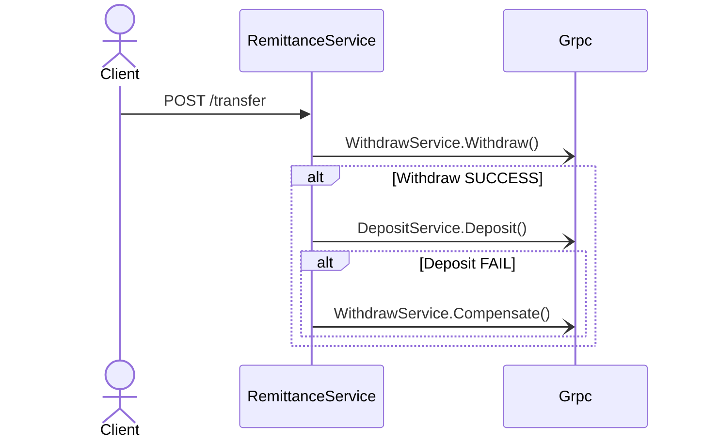

### 6.1 왜 SAGA인가?

- **2PC**는 락·지연·단일 DB 종속 → 클라우드 MSA 부적합
- SAGA = **여러 개의 로컬 트랜잭션 + 이벤트/명령** 연쇄

### 6.2 두 가지 접근

| 방식                                        | 장점                    | 단점               | Spring/Armeria 구현                                       |
| ------------------------------------------- | ----------------------- | ------------------ | --------------------------------------------------------- |
| **Choreography** (이벤트 기반)          | Orchestrator 없음, 단순 | 서비스 수 ↑ → 복잡 | Kafka Topic 구독 `@KafkaListener`                     |
| **Orchestration** (중앙 오케스트레이터) | 흐름 명확, 관리 용이    | 단일 실패점 가능   | Armeria gRPC Orchestrator Spring Boot Worker Services |

### 6.3 예제: 출금 → 입금 SAGA (Armeria gRPC)

- **보상 트랜잭션**: `WithdrawService.Compensate()`
- **Idempotency**: `x-remit-idempotent-key` 헤더 + PK 인덱스
- **Timeout & Retry**: `Resilience4j` + gRPC stub `withDeadlineAfter(...)`
