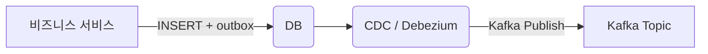

> **트랜잭션 DB와 Kafka 메시지를 100 % 동기화**하려면 Outbox 패턴이 거의 필수입니다.

## 9.1 문제 정의

| 상황                                          | 문제                                                  |
| --------------------------------------------- | ----------------------------------------------------- |
| JDBC Tx **Commit 성공** → Kafka **전송 실패** | 데이터는 저장됐지만 이벤트 미발행 → 다운스트림 불일치 |
| Kafka **전송 성공** → JDBC **RollBack**       | 존재하지 않는 비즈니스 데이터 이벤트 발행             |

## 9.2 Outbox 패턴 개념

1. **동일 트랜잭션** 안에서 비즈니스 테이블 + **outbox 테이블** 에 레코드 삽입
2. 커밋 후 **별도 프로세스**(CDC·스케줄러)가 outbox → Kafka 로 전송
3. 성공 시 outbox 상태 =`PROCESSED` 로 업데이트



## 9.3 Spring Boot + Debezium 구현

### 1️⃣ 스키마 예시

```sql
CREATE TABLE remittance_outbox (
  id            BIGINT       PRIMARY KEY AUTO_INCREMENT,
  aggregate_id  BIGINT       NOT NULL,
  event_type    VARCHAR(50)  NOT NULL,
  payload       JSONB        NOT NULL,
  status        VARCHAR(20)  DEFAULT 'PENDING',
  created_at    TIMESTAMP    DEFAULT now()
);
```

### 2️⃣ 엔티티 & 레포지토리

```java
@Entity
@Table(name = "remittance_outbox")
public class OutboxEvent {
    @Id @GeneratedValue
    private Long id;
    private Long aggregateId;
    private String eventType;
    @Type(JsonType.class)
    private String payload;
    private String status = "PENDING";
    // …getter/setter
}
```

### 3️⃣ 비즈니스 서비스 내 **한 트랜잭션**

```java
@Transactional
public void withdraw(RemittanceCommand cmd) {
    account.decrease(cmd.amount());
    remittanceTxRepo.save(tx);

    OutboxEvent evt = OutboxEvent.of(tx.getId(), "WITHDRAW_COMPLETED", mapper.writeValueAsString(tx));
    outboxRepo.save(evt);
}
```

### 4️⃣ Debezium Connector 설정

```json
{
  "name": "outbox-connector",
  "config": {
    "connector.class": "io.debezium.connector.mysql.MySqlConnector",
    "database.hostname": "mysql",
    "database.user": "debezium",
    "database.password": "dbz",
    "table.include.list": "bank.remittance_outbox",
    "transforms": "unwrap,route",
    "transforms.unwrap.type": "io.debezium.transforms.ExtractNewRecordState",
    "transforms.route.type": "org.apache.kafka.connect.transforms.RegexRouter",
    "transforms.route.regex": "bank.remittance_outbox",
    "transforms.route.replacement": "ledger-events"
  }
}
```

Debezium → Kafka Connect 가 `ledger-events` 토픽으로 밀어주며, **Exactly-Once** 보장을 위해
`transactional.id` 와 `enable.idempotence=true` 설정을 함께 사용합니다.

## 9.4 Armeria 환경 팁

- Armeria 서버에 **CDC 결과 Consumer** 를 구현해도 되지만,
  보통 Spring Kafka 리스너를 별도 모듈로 두고 Armeria 쪽으로 gRPC 호출만 위임합니다.

## 9.5 정리

- **DB Tx ↔ 이벤트** 불일치를 제거
- Debezium + Kafka Connect 로 구현 난이도 ↓
- 보상 트랜잭션과 함께 쓰면 **금융권 감사 요건 충족**
